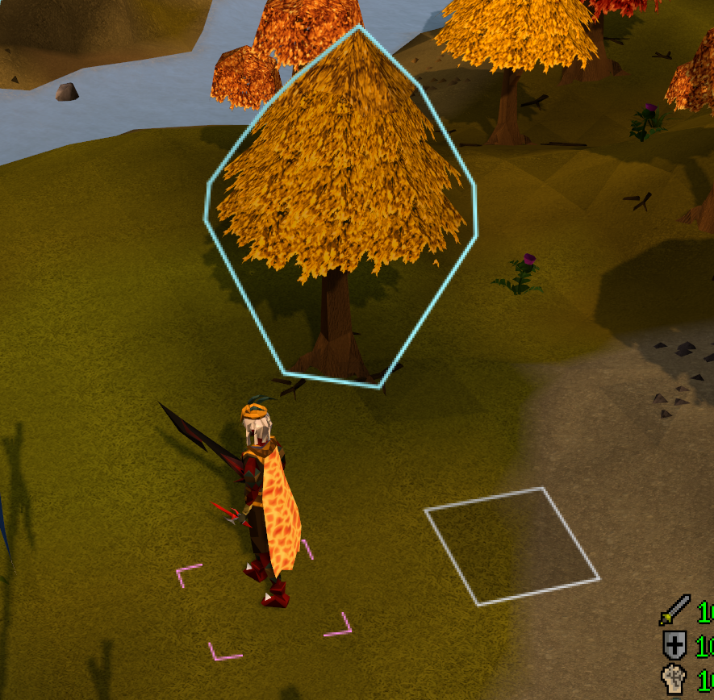
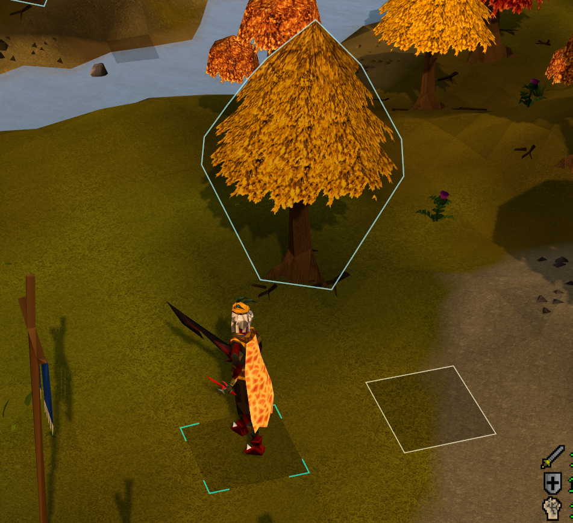
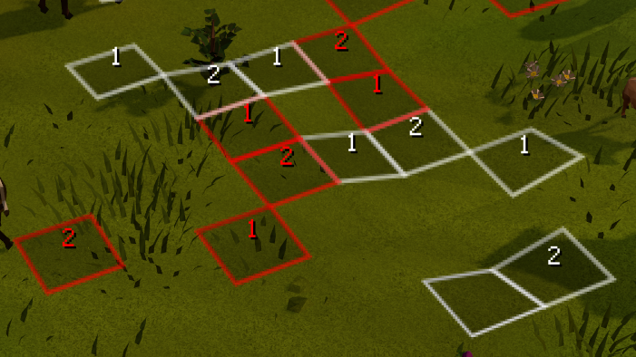
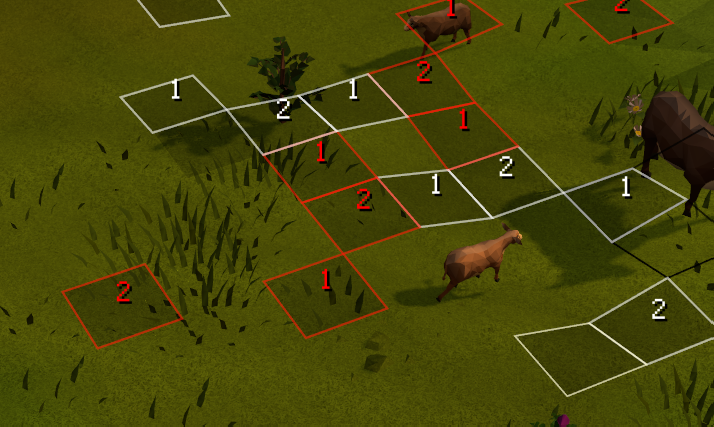
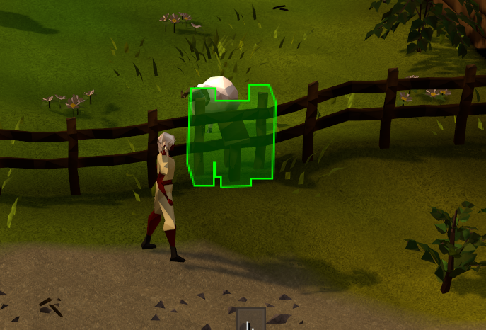
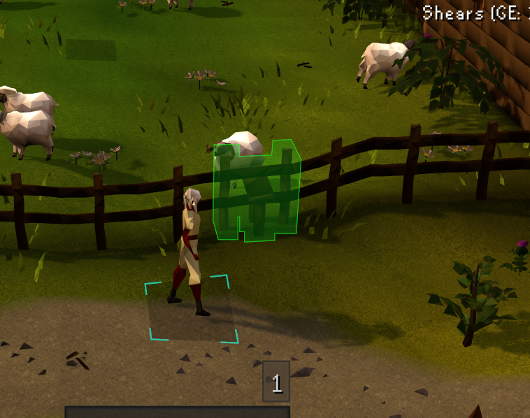

# HD World Markers

Draws tile, object, NPC and path markers in the game world instead of on the interface. The interface is scaled along with the rest of the client (Stretched Mode, client scaling), which makes normal markers thick and blurry. Markers in the world are rendered with the scene at your full resolution, so they stay sharp.

Needs the GPU plugin or 117 HD. Without it, markers are drawn the normal way.

Left: RuneLite's normal markers in Stretched Mode. Right: HD World Markers.

| Before | After |
|---|---|
|  |  |
|  |  |
|  |  |

Mark tiles, objects and NPCs with Shift + right-click, as with RuneLite's own marking plugins. Your marks from those are copied over on the first start, and the tile packs you turned on are drawn too. It also draws agility obstacles, shortcuts and marks of grace, your destination, hovered and current tile and the path you walk, and other plugins can send it marks to draw.

## For plugin developers

Your plugin can have its tiles, timer pies and NPC highlights drawn by HD World Markers, sharp and in the world, without depending on it. Post a `PluginMessage`; without HD World Markers installed, nothing happens.

```java
Map<String, Object> tile = Map.of("point", new WorldPoint(3222, 3218, 0), "color", Color.CYAN);
eventBus.post(new PluginMessage("hd-world-markers", "tiles", Map.of("owner", "my-plugin", "tiles", List.of(tile))));
```

Each message replaces your earlier tiles; send `clear` with your `owner` when your plugin stops. Fill, width, labels, timer pies and NPC highlights are in the [guide](https://github.com/Maiz19/in-world-tile-markers/blob/main/docs/GUIDE.md#for-plugin-developers).

[Guide](docs/GUIDE.md) · [Credits](THIRD_PARTY_NOTICES.md) · [License](LICENSE)
